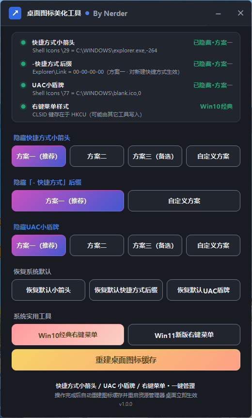
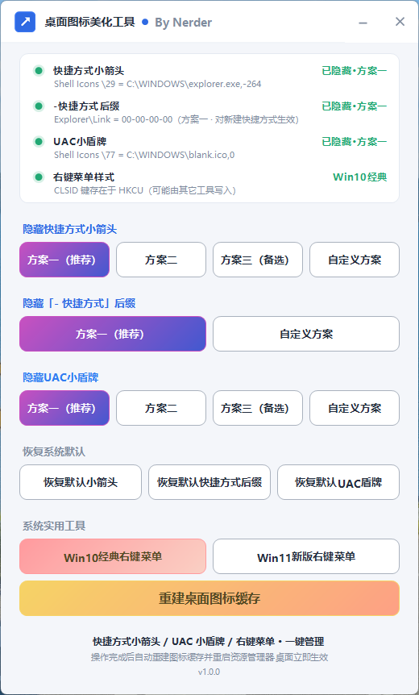

# 桌面图标美化工具

> Windows 11 / 10 桌面图标一键美化：隐藏快捷方式小箭头、隐藏「- 快捷方式」后缀、隐藏 UAC 小盾牌、Win10/Win11 右键菜单切换、重建图标缓存。
> 单文件绿色免安装，双击即用，自动跟随系统深色/浅色模式。

  

---

## ✨ 功能一览

- 隐藏快捷方式小箭头：多种社区方案+自绘方案+自定义方案识别
- 隐藏「- 快捷方式」后缀：支持查看参数与一键恢复
- 隐藏 UAC 小盾牌：多种社区方案+自绘方案+自定义方案识别
- 恢复系统默认：小箭头 / 快捷方式后缀 / UAC 盾牌 独立一键恢复
- 系统实用工具：Win10 经典右键菜单 ⇄ Win11 新版右键菜单 切换（支持强删 HKLM 中 TrustedInstaller 所有的 CLSID 键）、重建桌面图标缓存（含 20 秒看门狗）

**状态卡**：四行实时状态（名称 + 彩色状态点 + 右侧徽标），哪个方案生效哪个按钮亮，一目了然。

## 🎨 界面预览

| 深色模式 | 浅色模式 |
|---|---|
|  |  |

- 无边框圆角窗口，深色/浅色模式实时跟随系统
- 方案按钮：选中实心渐变高亮，未选中描边
- 状态卡：四行状态 + 彩色徽标，执行中对应行显示琥珀色「正在执行…」

## 🔧 原理说明

| 功能 | 注册表位置 | 隐藏 | 恢复 |
|---|---|---|---|
| 小箭头 | `HKLM\SOFTWARE\Microsoft\Windows\CurrentVersion\Explorer\Shell Icons` | 写入 `29 = <空图标>` | 删除 `29` |
| UAC 盾牌 | 同上 | 写入 `77 = <空图标>` | 删除 `77` |
| 「- 快捷方式」后缀 | `HKCU\Software\Microsoft\Windows\CurrentVersion\Explorer` | `Link = hex:00,00,00,00` | 删除 `Link` |
| 右键菜单 | `HKCU\Software\Classes\CLSID\{86ca1aa0-34aa-4e8b-a509-50c905bae2a2}` | 删除该键 = Win11 新版 | 创建 `InprocServer32` 空默认值 = Win10 经典 |

- 所有方案都**只改外观，不修改任何程序权限**，UAC 弹窗行为完全不受影响；
- 右键菜单切换采用「先结束 Explorer → 停止期间改注册表 → 再拉起」的顺序，避免键值已改菜单未变的缓存问题；若个别系统仍未生效，注销一次即可；
- 恢复 Win11 菜单时会同时清理 **HKCU 与 HKLM** 两处 CLSID 键——部分工具会把键写到 HKLM（TrustedInstaller 所有），程序会自动接管所有权后强删；
- 清理 `blank.ico` 前会检查另一功能是否正在使用，避免互相破坏。

## 🛠 纯脚本版本

`legacy/cmd/` 目录提供与 GUI 功能一一对应的独立批处理脚本（无 GUI、可搭配计划任务使用）：

- `隐藏快捷方式小箭头.cmd`
- `隐藏「- 快捷方式」后缀.cmd`
- `隐藏UAC小盾牌.cmd`
- `右键菜单切换.cmd`
- `重建桌面图标缓存.cmd`

双击运行 → 菜单选择 → 自动执行，逻辑与 GUI 版一致。`legacy/快捷方式小箭头.cmd` 为最早的合并版脚本（存档）。

## 📦 下载与使用

1. 从 [Releases](../../releases) 下载 `桌面图标美化工具-v1.0.0.exe`；
2. 双击运行，UAC 弹窗点「是」（程序需要管理员权限修改注册表）；
3. 点击对应方案按钮即可，完成后自动重建图标缓存并重启资源管理器，桌面立即生效；
4. 程序为**单实例**，重复双击会提示已在运行；Esc 可关闭窗口。

> 无需安装 .NET：Win10/11 系统自带运行时。exe 完全自包含（blank.ico 等资源已内嵌），可单独拷贝到任意位置运行。

## 🧱 从源码构建

无需安装 Visual Studio，Windows 自带的 .NET Framework 编译器即可：

```bat
cd src
build.cmd
```

产物为项目根目录的 `DesktopIconBeautifier-v<版本>.exe`（构建输出名，含 UAC 清单、多尺寸图标、内嵌资源）。版本号在 `build.cmd` 顶部的 `APP_VERSION` 处统一修改，exe 文件名与界面底部版本号自动跟随；发布 Release 时将其重命名为 `桌面图标美化工具-v<版本>.exe` 作为附件上传。

<details>
<summary>构建细节</summary>

- 编译器：`%WINDIR%\Microsoft.NET\Framework64\v4.0.30319\csc.exe`（C# 5 / WinForms）
- `/win32manifest:app.manifest` → requireAdministrator
- `/win32icon:app.ico` → 多尺寸 32-bit 图标（`gen-icon.ps1` 生成）
- 内嵌资源：`blank.ico`（透明图标）、`logo64.png`（标题栏高清 LOGO）
- `src/VersionInfo.cs` 由 build.cmd 自动生成（勿手改）；`app.manifest.invoker` 为开发预览用 asInvoker 清单，非发布必需
</details>

## ❓ 常见问题

<details>
<summary>隐藏后缀对已有快捷方式无效？</summary>

后缀设置只在**新建**快捷方式命名时读取，已有快捷方式请手动重命名。
</details>

<details>
<summary>切换 Win11 新版菜单后仍显示经典菜单？</summary>

1. 程序已采用「结束 Explorer → 改键 → 拉起」的可靠顺序，并可强删 HKLM 中 TrustedInstaller 所有的键；
2. 若个别系统仍未生效，注销一次即可；
3. 若某些工具反复把键写回 HKLM，状态卡会标注「CLSID 键存在于 HKLM」，再点一次按钮即可强删。
</details>

<details>
<summary>去除盾牌后 exe 图标右下角出现带边框的透明方块？</summary>

使用「方案一（blank.ico）」，全透明图标不会产生该残留。
</details>

<details>
<summary>图标改了但桌面没变化？</summary>

点「重建桌面图标缓存」；若提示缓存被占用，请注销或重启一次。
</details>

## 📄 许可证

[MIT License](LICENSE)
